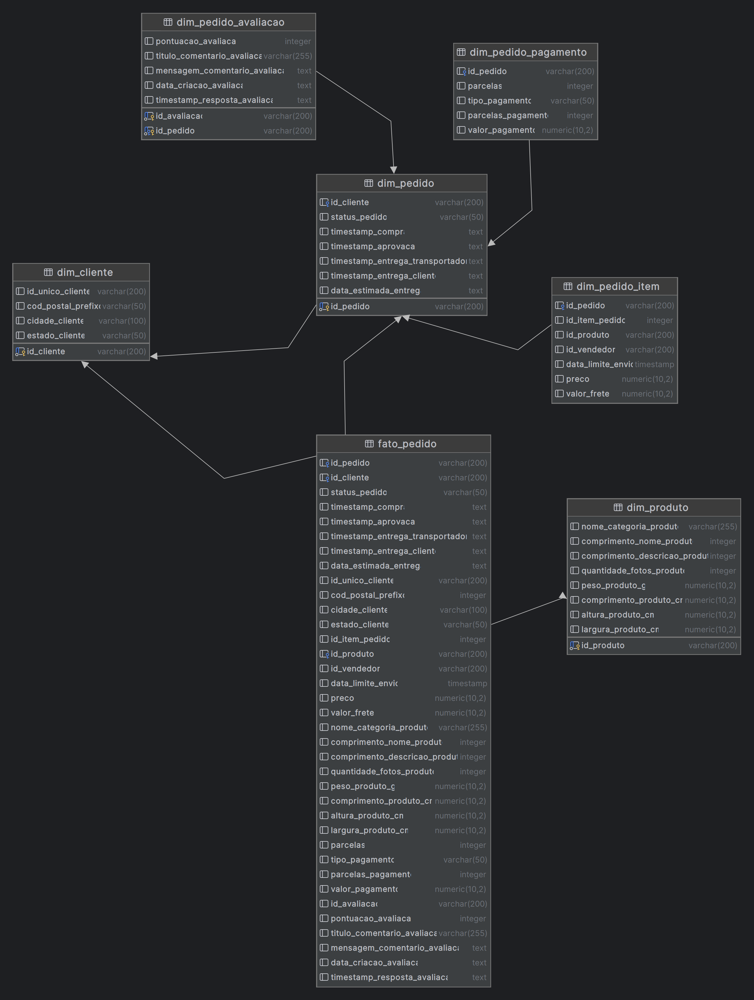

<div align="center">

# Construção do Data Warehouse: E-Commerce

Este projeto implementa um **Data Warehouse modelado dimensionalmente para E-Commerce utilizando PostgreSQL, Docker e Python**. Com a centralização dos dados de vendas, clientes, avaliações e produtos podemos extrair insights estratégicos.

</div>

Informações úteis sobre o dataset:

> _O conjunto de dados utilizado contém informações de 100 mil pedidos de 2016 a 2018 feitos em vários marketplaces no Brasil. Seus recursos permitem visualizar um pedido em múltiplas dimensões: desde status do pedido, preço, desempenho de pagamento e frete até localização do cliente, atributos do produto e finalmente avaliações escritas pelos clientes._
 


## Requisitos:

- _Docker Compose (Obrigatório) & Docker CLI (Opcional)_
- _PostgreSQL_
- _Python_
- _[Libs Python](./requirements.txt)_


## Funcionalidades

### ETL

A construção do ETL foi dívida nas seguintes etapas:

**Extract**: A extração dos dados foi de um dataset público de ecommerce do Kaggle > [_Link para o dataset_](https://www.kaggle.com/datasets/olistbr/brazilian-ecommerce)

**Transform**: A análise e limpeza e transformação dos dados foi feito no **Jupyter Notebook, por opção pessoal. Consigo analisar os dados e limpa-los de uma maneira mais eficiente utilizando o Jupyter Notebook**. No próprio notebook estão todos os meus comentários e decisões que tomei para manter os dados consistentes e prontos para serem carregados no DW. > **Notebook: [Análise e Limpeza do Dataset](./analysis.ipynb)**

**Load**: Para carregamento após extração e transformação dos dados no nosso dataset utilizei a biblioteca **psycopg2** para Bancos de dados PostgreSQL. Para isso, decidi montar o script python que você pode conferir **[aqui](./etl.py)** porém será explicado em seguida.

#### Script para Carregamento

Primeiramente, defini algumas variáveis de ambiente carregadas diretamente do meu ambiente, em casos de produção, trata-se de uma prática recomendável. Porém, caso não queira utilizar as definidas no arquivo **[docker-compose.yml](./docker-compose.yml)** que disponibilizo já configurando na pasta principal do projeto. _Obs: No final das sessões ensino como utilizar e executar o projeto com o docker-compose._

Em seguida, para facilitar o processo decidi criar duas funções que retornassem queries que serão utilizadas na construção do Data Warehouse...

#### Função para gerar query de tabelas:

```python
def criar_tabela(nome_tabela, colunas):
    query = f"CREATE TABLE {nome_tabela} ("

    colunas_definicoes = []

    for coluna, tipo in colunas.items():
        colunas_definicoes.append(f"{coluna} {tipo}")

    query += ", ".join(colunas_definicoes)
    query += ");"

    return query
```

Nesta função eu decidi por fazer ela recebendo dois parâmetros: O nome da tabela e as suas colunas. 

- As colunas serão passadas como dicionários, seguinda a lógica de {COLUNA: TIPO}. Dito isso, é feito uma iteração neste dicionário adicionando os valores de {coluna + tipo} em uma lista.
- No final, é feito uma junção a query principal dos valores definidos na variável `colunas_definicoes`

Aqui segue o exemplo do seu funcionamento:

```python
criar_tabela("biblioteca", {'id_biblioteca': 'INTEGER PRIMARY KEY', {'localizacao_biblioteca': 'VARCHAR(200)'}})
```

Será criada uma Query com a seguinte estrutura:
```sql
CREATE TABLE biblioteca (
    id_biblioteca INTEGER PRIMARY KEY,
    localizacao_biblioteca VARCHAR(200)
);
```

#

#### Função para gerar query de inserções:

```python
def gerar_query_insert(df, nome_tabela):
    colunas = ", ".join(df.columns)
    query = f"INSERT INTO {nome_tabela} ({colunas}) VALUES\n"
    valores = []
    for _, row in df.iterrows():
        valor = ", ".join([f"'{str(v).replace('\'', '').replace('\"', '')}'" if isinstance(v, str) else str(v) for v in row])
        valores.append(f"({valor})")

    query += ",\n".join(valores) + ";"
```

Nesta função decidi também por definir ela recebendo dois parâmetros: Dataframe, Nome da tabela de inserção.

A finalidade é a mesma da de cima (Gerar uma Query), porém ela recebe no seu primeiro parâmetro as nossas dimensões ou tabelas fatos, que eu decidi carregar utilizando o pandas. 

- Separei as colunas do dataframe em uma lista `colunas`.
- Inicio da montagem da nossa query definindo sua estrutura inicial. 
- Iteração sobre as linhas do dataframe utilizando a seguinte lógica: Para cada valor (v) em uma linha (row), verifico se é uma string e formato para ser inserido na query SQL (_Foi necessário fazer isto pois tem algumas colunas com valores com aspas que preferi tratar aqui por ser algo mais simples e que não apresentar necessariamente uma inconsitência._).
- Pós iteração, juntei todos os valores em uma nova lista com a seguinte lógica "({valor})", "({valor})" pois assim consigo definir os valores a serem inseridos.
- No final do código juntei todos os valores serapados por vírgula, montando a nossa query final. :)

Aqui segue o exemplo do seu funcionamento:

```python
data = {
    'id': [1, 2, 3],
    'nome': ['Alice', 'Bob', 'Charlie'],
    'idade': [25, 30, 35]
}
df = pd.DataFrame(data)

gerar_query_insert(df, 'usuarios')
```

Será criada uma Query com a seguinte estrutura:
```sql
INSERT INTO usuarios (id, nome, idade) VALUES
    (1, 'Alice', 25),
    (2, 'Bob', 30),
    (3, 'Charlie', 35);
```

#

> Com essas funções bem definidas, me preocupo apenas em carregar os dataframes no script, definir as colunas e tabelas e apenas carregar no banco de dados de forma programática. 

_Assim finalizamos nossa construção do Data Warehouse modelado dimensionalmente._

Segue a imagem do resultado da modelagem dimensional.

<div align="center">



</div>


#

### Como executar o projeto:

Para execução do projeto, será necessário as ferramentas definidas na [seção inicial](#requisitos).

Vá até a pasta principal do projeto e execute (_Caso tenha e queira utilizar o PostgreSQL instalado na sua máquina pode pular esta etapa_):

```bash
docker-compose up -d
```

Com o banco de dados rodando na sua máquina. Baixe e instale as libs necessárias para o projeto:

```bash
pip install -r requirements.txt
```

Após as libs terem sido instaladas corretamente, crie o arquivo .env _(Caso esteja utilizando o seu ambiente nativo)_:

```env
DB=seu_banco_de_dados
USER=seu_usuario
PASS=sua_senha 
```

Após isso, execute todas as células do seu notebook:

```bash
jupyter nbconvert --to notebook --execute seu_notebook.ipynb --output executed_notebook.ipynb
```

E por fim, execute o script python:

```bash
python etl.py
```

#

### Todos os Recursos Úteis

- Link do dataset: [Dataset](https://www.kaggle.com/datasets/olistbr/brazilian-ecommerce/data)
- Arquivo ETL: [etl.py](./etl.py)
- Notebook: [analysis.ipynb](./analysis.ipynb)
- Docker Compose: [docker-compose.yml](./docker-compose.yml)
- Libs Python: [requirements.txt](./requirements.txt)
- Resultado Modelagem Dimensional: [modelagem-dimensional.png](./img/modelagem-dimensional.png)