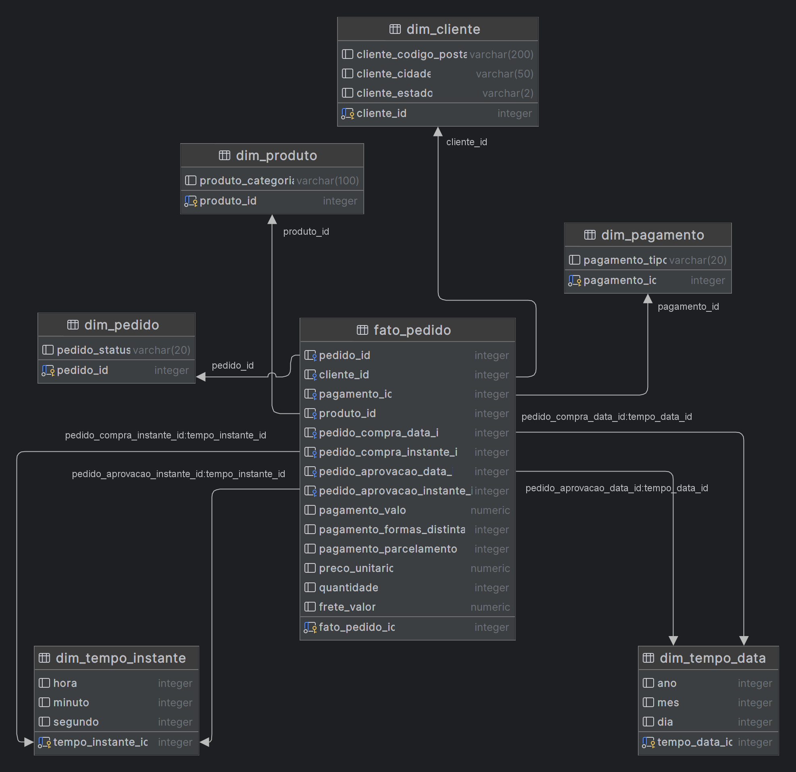

<div align="center">

# Construção do Data Warehouse: E-Commerce

Este projeto implementa um **Data Warehouse modelado dimensionalmente para E-Commerce utilizando PostgreSQL, Docker e Python**. Com a centralização dos dados de vendas, clientes, avaliações e produtos podemos extrair insights estratégicos.

</div>

Informações úteis sobre o dataset:

> _O conjunto de dados utilizado contém informações de 100 mil pedidos de 2016 a 2018 feitos em vários marketplaces no Brasil. Seus recursos permitem visualizar um pedido em múltiplas dimensões: desde status do pedido, preço, desempenho de pagamento e frete até localização do cliente, atributos do produto e finalmente avaliações escritas pelos clientes._

**Estrutura do Dataset:**


## Requisitos:

- _Docker Compose (Obrigatório) & Docker CLI (Opcional)_
- _PostgreSQL_
- _Python_
- _[Libs Python](./requirements.txt)_


## Construção do Datawarehouse

Para a construção do Datawarehouse, separei em 3 etapas:

- Processamento dos Dados para a Camada Trusted
- Processamento dos Dados para a Camada Refined
- Carregamento dos Dados para o Datawarehouse

### Processamento Trusted

Nessa etapa, o processamento e limpeza dos dados da camada **BRUTA(Raw)** visa tornar os nosso dados confiáveis para a modelagem dimensional. O script principal se encontra na pasta `/etl_scripts/processing_trusted.py`, porém a construção de todo raciocínio e tomada de decisões se encontra nos notebooks da camada trusted.

- [Notebooks Trusted](./notebooks_trusted/README.md)

### Processamento Refined

Nessa etapa, o processamento e limpeza dos dados da camada **TRUSTED** visa tornar os nossos dados refinados e prontos para a modelagem analítica e relatórios. O script principal se encontra na pasta `/etl_scripts/processing_refined.py`, porém a construção de todo raciocínio e tomada de decisões se encontra nos notebooks da camada refined, seguindo a mesma lógica dos notebooks da trusted.

- [Notebooks Refined](./notebooks_refined/README.md)

### Carregamento para o Datawarehouse

Antes de continuar para a etapa final, com os dados já refinados, segue o resultado da nossa modelagem dimensional:



Agora com nosso modelo definido, construi um script python que me ajudasse a automatizar o processo de construção do datawarehouse via python, sem necessidade de executar nenhum código SQL.

Nesse código acontece a automatização da criação das tabelas e automatização da criação das queries de inserções.

Segue o Script principal:

- [load_to_dw.py](./etl_scripts/load_to_dw.py)

#

## Execução do Projeto

#### Verifique os notebooks (Opcional):

- _Caso precise entender o processo de construção dos scripts, acompanhe os notebooks nas pasta: [notebooks_trusted](./notebooks_trusted/README.md)  e [notebooks_refined](./notebooks_refined/README.md) para entender melhor o processo e as decisões que resolvi tomar para a transformação dos dados._
- _Siga o README para uma visão geral e links para notebooks específicos._

#### Execução dos Scripts de Processamento e Limpeza dos Dataset

- Antes de iniciar a execução dos scripts de processamento, é necessário que baixa as libs através do comando:

```bash
pip install -r requirements.txt
```

- Navegue até a pasta `etl_scripts`.
- Execute o script `processing_trusted.py` para iniciar o processamento dos dados (É necessário que você altere o path para o seu dataset que você pode baixar [aqui](https://www.kaggle.com/datasets/olistbr/brazilian-ecommerce/data).)

```bash
python processing_trusted.py
```

- Com os dados confiáveis: Execute o script `processing_refined.py` para iniciar o refinamento dos dados.

```bash
python processing_refined.py
```

- Agora com os dados confiáveis, antes de carregar eles com nosso script. Será necessário você alterar as variáveis `DB, USER, PASS` com as suas credenciais ou executar o docker-compose através do seguinte comando:

```bash
docker-compose up -d
```

- Caso tenha utilizado o docker-compose, atualize as variáveis `DB, USER, PASS` com as credencias no arquivo [docker-compose.yml](./docker-compose.yml)

- Com o nosso banco de dados relacional em execução na nossa máquina local e as variáveis alteradas devidamente podemos executar o carregamento da nossa modelagem relacional para o nosso banco de dados.

```bash
python load_to_dw.py
``` 

- E assim teremos nosso Datawarehouse construído, caso queira visualizar com mais detalhes utilize o `pgAdmin` ou SGBD a sua escolha. Minha recomendação é a utilização do `Datagrip` caso queria visualizar de forma mais robusta e interativa.

#

### Todos os Recursos Úteis

- Link para o dataset: [Dataset](https://www.kaggle.com/datasets/olistbr/brazilian-ecommerce/data)

- Notebooks
    - [Notebooks Trusted](./notebooks_trusted/README.md)
    - [Notebooks Refined](./notebooks_refined/README.md)
- Scripts
    - [Processamento Trusted](./etl_scripts/processing_trusted.py)
    - [Processamento Refined](./etl_scripts/processing_refined.py)
    - [Carregamento para o DW](./etl_scripts/load_to_dw.py)
- Docker Compose: [docker-compose.yml](./docker-compose.yml)
- Libs Python: [requirements.txt](./requirements.txt)
- Resultado Modelagem Dimensional: [modelagem-dimensional.png](./img/modelagem-dimensional.png)